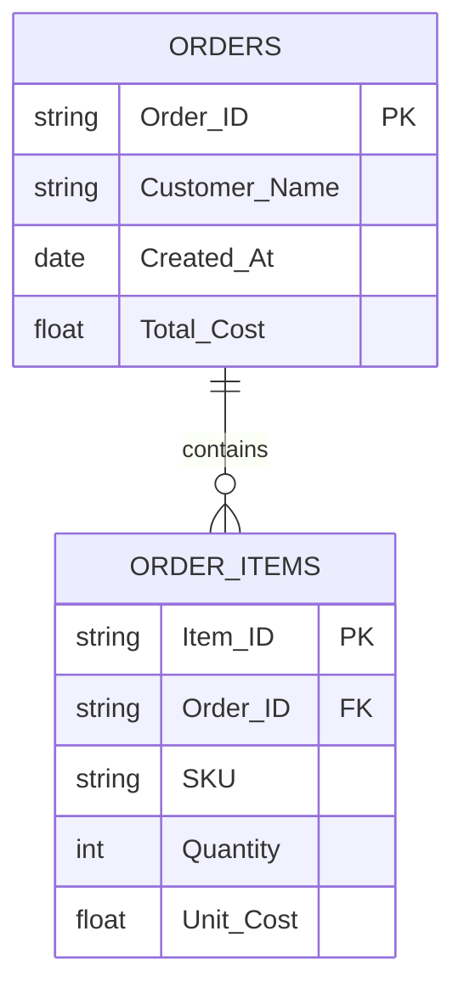
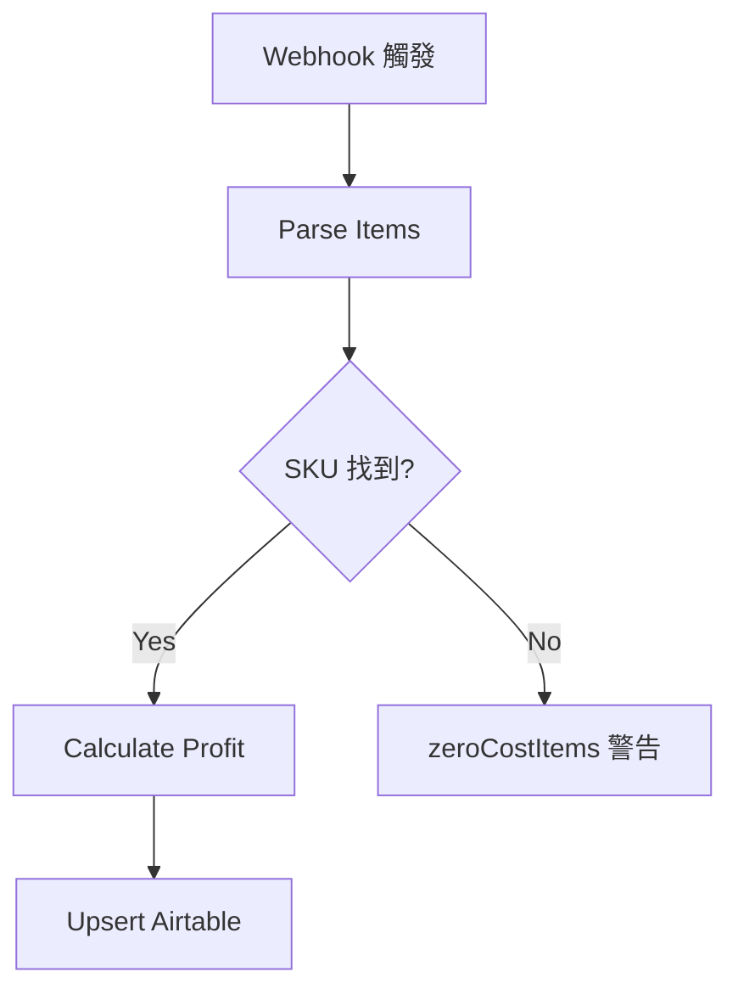
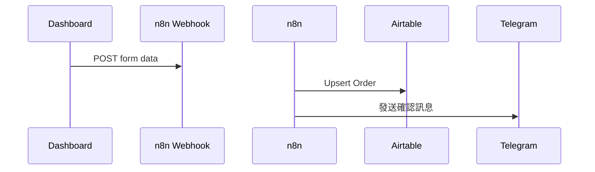

# mermaid — Schema 視覺化圖表生成

> **Master 定義**。橋接版位於 `.claude/commands/mermaid.md`。

**技能來源**：awesome-claude-code（FHS 適配版）

---

## 用途

從 SQL schema、Airtable 欄位定義、或口述描述，生成 Mermaid 圖表語法（ER 圖、流程圖、序列圖）。

## 執行步驟

收到 `/mermaid [描述 / schema / 表名]` 後：

1. 分析提供的 schema 或描述，識別：
   - 資料表 / Airtable base 的欄位與類型
   - 表與表之間的關聯（外鍵、Lookup、關聯欄位）
   - 資料流向（若為流程圖）

2. 生成對應的 Mermaid 語法

3. 附上使用說明（如何在 GitHub README / Notion 中顯示）

## 支援圖表類型

### ER 圖（資料庫 Schema）


### 流程圖（Workflow）


### 序列圖（系統互動）


## FHS 使用場景

| 場景 | 圖表類型 |
|-----|---------|
| Airtable 三表關聯文檔化 | ER 圖 |
| Supabase 遷移 schema 規劃 | ER 圖 |
| n8n Workflow 邏輯視覺化 | 流程圖 |
| AI 系統呼叫鏈文檔 | 序列圖 |

## 使用範例

```
/mermaid 請為 FHS Airtable 的 Orders、Order_Items、Product_Database 三個表生成 ER 圖
```

```
/mermaid 請為 n8n V45.7.4 的訂單提交流程生成流程圖
```
