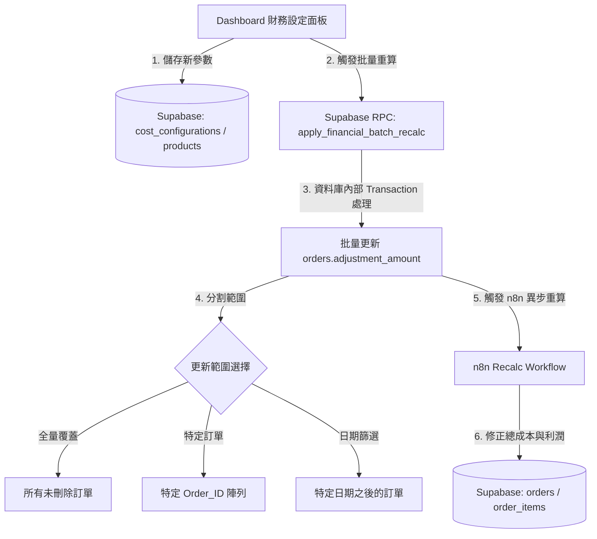

# FHS Dashboard Local Implementation Plan — 財務設定系統 (Financial Settings System)

> **日期**：2026-05-27
> **負責代理**：Antigravity (A2)
> **狀態**：⏳ 規劃階段 (待 Fat Mo 與 A3 審查授權)
> **關聯 SOP**：`.fhs/notes/SOP_NOW.md`

---

## 1. 批判性自審 (Critique & Self-Reflection)

針對常見的財務設定系統與批量更新實作，我們指出以下 **3 個致命弱點**，並在下方提出更優的架構版本。

### 🚨 弱點 1：客戶端循環更新 (Client-Side Looping) 導致的效能與 API 崩潰
* **常規做法**：前端 JavaScript 發起 API 查詢符合範圍的訂單，在瀏覽器內用 `for` 迴圈逐筆修改數據，再發送數十甚至數百筆獨立的 Supabase UPDATE 請求。
* **致命後果**：
  1. 瀏覽器在處理大量異步 Promise 時容易卡死或超時。
  2. 消耗大量 Supabase API 配額 (Airtable / Supabase 呼叫次數暴增)。
  3. 若網路在中途斷線，會造成「部分更新、部分未更新」的數據不一致慘劇。

### 🚨 弱點 2：繞過 n8n 進行前端直接毛利計算 (Calculation Parity Drift)
* **常規做法**：前端自行讀取新的產品成本與折扣，在網頁端計算出 `orders.total_cost` 和 `net_profit` 後直接寫入資料庫。
* **致命後果**：
  - 違反 **AGENTS.md** 憲法規範的「n8n 負責財務核心計算 (SSoT)」原則。
  - 前端計算容易遺漏複雜的業務規則（例如鎖匙扣跨部位運費扣減 §2.5、配件不重複計入成本等），導致前端寫入的數據與後台自動對帳結果產生「財務漂移」(Financial Parity Drift)。

### 🚨 弱點 3：UI 雜亂無章與缺乏防呆的安全隱患 (No Safety Valve)
* **常規做法**：直接在原有訂單表單中插入大片設定欄位，且批量更新按鈕點擊即執行。
* **致命後果**：
  - 破壞 V41 Dashboard 精簡的行動端 (iPhone) 佈局，增加 Drawer 鏡像維護的複雜度。
  - 無防呆機制，操作者可能因誤點「全量覆蓋」導致歷史數年的已結帳財務數據被毀滅性覆蓋。

---

## 2. 更好的版本：精簡且安全的財務設定架構

為了解決上述弱點，我們為 FHS 設計了 **Supabase-First 事務批量更新架構**：



### 💡 核心改進點
1. **資料庫端 RPC 批量更新 (DB-Side Transaction)**：
   - 不在前端做循環。前端僅傳遞「更新範圍條件」與「更新參數」給 Supabase 預存程序 (RPC)。由資料庫內部事務 (Transaction) 一口氣完成更新，網路消耗降為 1 次 Request，且保證原子性 (All or Nothing)。
2. **防呆解鎖門檻 (Double-Lock & Impact Estimate)**：
   - UI 執行批量更新前，先呼叫一個輕量級 SQL `COUNT`，告訴用戶：「此操作預計影響 **X** 筆訂單，涉及金額 **$Y**」。
   - 用戶必須在輸入框輸入安全確認字串（如 `CONFIRM`）才可解鎖按鈕，防止誤觸。
3. **分層計算防漂移 (Separation of Concerns)**：
   - 前端僅將「成本與折扣設定」持久化到 `cost_configurations` 與 `products` 表。
   - 歷史訂單更新時，資料庫僅將 `adjustment_amount` (人工折扣/補打費) 與需要更新的標記打上，並發送一個 Batch ID 給 n8n Webhook，讓後台在伺服器端異步重算所有受影響訂單的 `total_cost` 與 `net_profit`，確保計算公式百分之百一致。

---

## 3. 實施計畫草案 (Implementation Plan)

### Phase 1: 基礎設定持久化與單筆即時套用
* 建立產品成本/折扣設定介面（嵌入 ⚙️ 系統設定面板，支援 Desktop + Mobile Drawer 鏡像）。
* 實現 `cost_configurations` 與 `products` 欄位的即時讀寫編輯。
* 修正新下單時，即時讀取最新設定值套用於當前訂單。

### Phase 2: 批量更新引擎 (Batch Update Engine)
* 設計 Supabase SQL RPC：`fhs_apply_financial_batch_update`。
* 前端批量控制器：支援選擇 **【全量】**、**【特定訂單 (逗號分隔)】**、**【特定日期之後】**。
* 前端防呆控制：受影響筆數預估、安全鎖字串驗證。

---

## 4. 擬議修改檔案清單 (Proposed Files changes)

### 📂 [NEW] `supabase/migrations/0020_financial_settings_system.sql`
* 建立遠端批量處理函數 `fhs_apply_financial_batch_update`：

```sql
-- 0020_financial_settings_system.sql
-- 建立財務批量套用 RPC 函數

CREATE OR REPLACE FUNCTION fhs_apply_financial_batch_update(
  p_scope TEXT,                  -- 'all', 'specific', 'date_after'
  p_target_date DATE DEFAULT NULL,
  p_target_orders TEXT[] DEFAULT NULL,
  p_adjustment_override NUMERIC DEFAULT NULL
)
RETURNS TABLE (
  affected_rows INTEGER,
  success BOOLEAN
) 
LANGUAGE plpgsql
SECURITY DEFINER
AS $$
DECLARE
  v_count INTEGER := 0;
BEGIN
  -- 1. 安全防禦：若未指定範圍則拒絕執行
  IF p_scope IS NULL OR p_scope NOT IN ('all', 'specific', 'date_after') THEN
    RAISE EXCEPTION '無效的套用範圍(p_scope)。必須為 all, specific 或 date_after';
  END IF;

  -- 2. 依範圍執行訂單財務欄位標記更新
  IF p_scope = 'all' THEN
    UPDATE orders
    SET 
      adjustment_amount = COALESCE(p_adjustment_override, adjustment_amount),
      updated_at = NOW()
    WHERE deleted_at IS NULL;
    
    GET DIAGNOSTICS v_count = ROW_COUNT;

  ELSIF p_scope = 'date_after' THEN
    IF p_target_date IS NULL THEN
      RAISE EXCEPTION '當範圍為 date_after 時，p_target_date 不可為空';
    END IF;
    
    UPDATE orders
    SET 
      adjustment_amount = COALESCE(p_adjustment_override, adjustment_amount),
      updated_at = NOW()
    WHERE deleted_at IS NULL 
      AND confirmed_at >= p_target_date;
      
    GET DIAGNOSTICS v_count = ROW_COUNT;

  ELSIF p_scope = 'specific' THEN
    IF p_target_orders IS NULL OR array_length(p_target_orders, 1) IS NULL THEN
      RAISE EXCEPTION '當範圍為 specific 時，p_target_orders 訂單清單不可為空';
    END IF;

    UPDATE orders
    SET 
      adjustment_amount = COALESCE(p_adjustment_override, adjustment_amount),
      updated_at = NOW()
    WHERE deleted_at IS NULL 
      AND order_id = ANY(p_target_orders);
      
    GET DIAGNOSTICS v_count = ROW_COUNT;
  END IF;

  -- 3. 返回結果
  affected_rows := v_count;
  success := TRUE;
  RETURN NEXT;
END;
$$;

COMMENT ON FUNCTION fhs_apply_financial_batch_update IS '安全地在資料庫端批量套用財務調整值，避免客戶端循環寫入效能瓶頸。';
```

### 📂 [MODIFY] `Freehandsss_Dashboard/freehandsss_dashboardV41.html`

1. **新增設定面板 UI 結構**：
   - 在 `#systemModeContainer` 的 QA 中心上方，插入一個名為 `🛠️ 財務參數與批量設定中心 (Financial Settings)` 的優雅 Card。
   - 包含：
     - 單項成本配置輸入（Drawing Cost, Printing Cost, Shipping Cost 等，綁定對應 SKU/Product 篩選）。
     - 批量更新設定區：選擇套用範圍（下拉選單）、日期選擇器（預設隱藏，僅在 date_after 顯示）、特定訂單輸入框（預設隱藏，僅在 specific 顯示）。
     - 安全確認輸入框 `<input type="text" id="batchSafetyLock" placeholder="請輸入 CONFIRM">`。
     - 執行按鈕 `<button id="btnExecuteBatchUpdate" disabled>`。
     - 筆數預估提示 `<span id="batchImpactEstimate" class="sys-sub">請選擇條件以估算受影響訂單...</span>`。

2. **新增 JavaScript 控制器與 Supabase 連動邏輯**：
   - 新增 `loadCostConfigurations()` 用於初始化讀取 Supabase 的 `cost_configurations` 並渲染至設定表單中。
   - 新增 `updateSingleCostConfig(id, data)` 用於儲存單個產品款式的 Unit Cost。
   - 新增 `estimateBatchImpact()` 監聽範圍欄位變化，發送輕量 SELECT COUNT 到 Supabase 以動態顯示預估受影響訂單數量。
   - 新增 `executeFinancialBatchUpdate()` 呼叫 RPC `fhs_apply_financial_batch_update`，完成後彈出 Toast 並自動重載當前模式。
   - 增加 Mobile Mirroring 機制：確保在 iPhone Drawer 開啟時，批量更新面板能完整鏡像至 Drawer 內，並保持操作邏輯一致。

---

## 5. NO-TOUCH 護欄與安全性聲明

> ⚠️ **重要**：此階段為本地分析與實施計畫產出。根據憲法架構規定，本代理人在此步驟**不得**對專案程式碼執行任何實體修改。計畫將直接呈報給 Fat Mo 與 A3 (Claude Code) 審查，獲得明確執行授權與簽名後，方可實施代碼層修改。
